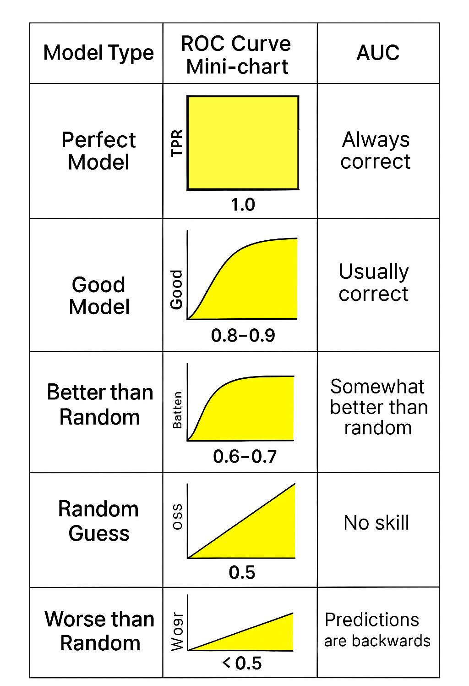

# Machine Learning Guide

## Types of ML Systems

1. **Supervised Learning**
   1. **Regression**: Predicts numeric values
   2. **Classification**: Predicts likelihood of something belonging to a category
      - **Binary**: Only two possible outcomes (e.g., spam or not spam)
      - **Multiclass**: More than two possible outcomes

2. **Unsupervised Learning**: Model is given data without correct answers; employs techniques like clustering to create groupings (e.g., private, public, work)

3. **Reinforcement Learning**: Learns by receiving rewards or penalties based on actions performed (e.g., self-driving cars)

4. **Generative AI**: Creates content from user input

---

## Regression Models

### 1. Linear Regression
**Formula**: `y = mx + b`

**Example**: [3x + 1](https://github.com/pravinvarma/tensorflowJS/blob/master/3x%2B1.html)

### 2. Polynomial Regression
**Formula**: `y = ax² + bx + c`

**Example**: [x² + 2x + 1](https://github.com/pravinvarma/tensorflowJS/blob/master/x%5E2%2B2x%2B1.html)

### 3. Logistic Regression
Logistic regression has two parts:
- **Linear regression**: `z = wx + b`
- **Logistic function**: `y = 1 / (1 + e^(-z))`

For calculating probabilities, we need the output between 0 and 1. The logistic function (sigmoid) converts linear regression output to a value between 0 and 1.

**Sigmoid function**: `f(x) = 1 / (1 + e^(-x))` where `e` is Euler's number (2.71828)

**Example**:
```
z = w₁x₁ + w₂x₂ + w₃x₃ + b
y = 1 / (1 + e^(-z))

For b=1, w₁=1, w₂=1, w₃=1, x₁=1, x₂=1, x₃=1:
z = 3
y = 1 / (1 + e^(-3)) = 0.9525741268224334
```

This means for z = 3 (linear value), the sigmoid output is 0.95, which is very close to 1. So the probability of y being 1 is 0.95.

---

## Classification Models

Logistic regression tells you the probability (in percentage) of whether a given email is spam or not. Classification tells you whether a given email is spam or not, instead of predicting the probability.

### Examples
1. **Binary Classification**: [Horse vs Human](https://github.com/pravinvarma/ML/blob/main/horseHuman.ipnyb)
2. **Multiclass Classification**: [Rock-Paper-Scissors](https://github.com/pravinvarma/ML/blob/main/load-rps-model.ipynb)

### Classification Threshold

If we have a probability of 0.50 for a given email being spam, we need to define a threshold for classification. The threshold is then assigned to classes:

1. **Positive class**: Email is spam
2. **Negative class**: Email is not spam

### Confusion Matrix

Depending on the outcome of classes, we can create a matrix where columns are truths and rows are predictions, called a **confusion matrix**:

|                           | **Actual Positive**                        | **Actual Negative**                                  |
| ------------------------- | ------------------------------------------ | ---------------------------------------------------- |
| **Predicted Positive**    | TP (spam is predicted correctly as spam)   | FP (not spam email is predicted as spam)             |
| **Predicted Negative**    | FN (spam email is predicted as not spam)   | TN (not spam email is correctly predicted as not spam) |

**Definitions**:
- **TP (True Positive)**: The actual outcome is positive and predicted is also positive
- **FP (False Positive)**: The actual outcome is negative while predicted is positive
- **FN (False Negative)**: The actual outcome is positive while predicted is negative
- **TN (True Negative)**: The actual outcome is negative and predicted is also negative

### Simplified Example of FP, FN, TP, and TN
You apply a threshold, for example 0.5:

1. If probability ≥ 0.5 → predict **Spam**
2. If probability < 0.5 → predict **Not Spam**

So your model’s final predictions become:

| Email | Probability | Prediction (Threshold = 0.5)       |
| :---: | :---------: | :--------------------------------- |
| A     | 0.95        | Spam ✅ (True Positive)            |
| B     | 0.80        | Spam ✅ (True Positive)            |
| C     | 0.60        | Spam ❌ (False Positive)           |
| D     | 0.40        | Not Spam ❌ (False Negative)       |
| E     | 0.10        | Not Spam ✅ (True Negative)        |


## Accuracy, Recall, Precision, and FPR

### Example Scenario

Suppose Dhanno received 10 emails in her inbox. Out of 10 emails:
- 2 are correctly identified as spam emails
- 2 emails which were not spam were identified as spam

So, we have the following:
- **TP** (emails identified as spam which were actually spam): 2
- **FP** (emails which were not actually spam but identified as spam): 2
- **FN** (spam emails identified as not spam): 2
- **TN** (not spam emails correctly identified as not spam): 4

### Formulas

1. **Accuracy** = (TP + TN) / (TP + TN + FP + FN)
2. **Recall** (True Positive Rate) = TP / (TP + FN) — How many actual spam emails were caught
3. **Precision** = TP / (TP + FP) — How accurate the spam predictions are
4. **FPR** (False Positive Rate) = FP / (FP + TN) — How many not-spam emails were wrongly flagged

### Calculations for Our Example

1. **Accuracy** = (2 + 4) / (2 + 4 + 2 + 2) = 6/10 = 0.6 → **60% accuracy**
2. **Recall** = 2 / (2 + 2) = 2/4 = 0.5 → Model found **50% of spam emails**
3. **Precision** = 2 / (2 + 2) = 2/4 = 0.5 → **50% of spam predictions are correct**
4. **FPR** = 2 / (2 + 4) = 2/6 = 0.33 → **33% were wrongly flagged as spam**

### Precision vs Recall Trade-off

**Note**: If Precision goes up, Recall goes down.

- **Precision** measures of all the items predicted, how many were positive (TP / (TP + FP)). It measures how accurate your positive predictions are.
- **Recall** is a measure of all actual positives, how many were correctly found (TP / (TP + FN)). It measures how many of the true positives you managed to catch.

**Higher Threshold**:
- You will be able to predict positive only when you are very sure → **Precision ⬆**
- But you will miss many positives that don't meet the higher threshold → **Recall ⬇**

**Lower Threshold**:
- The reverse happens → **Precision ⬇**, **Recall ⬆**

---

## ROC and AUC

### ROC (Receiver Operating Characteristics)
Shows your model's ability to separate two classes as you move the threshold. It has:
- **X-axis**: FPR (False Positive Rate)
- **Y-axis**: TPR (True Positive Rate / Recall)

### AUC (Area Under Curve)
Shows your model's ability to separate two classes independent of threshold.

| Model Type            | ROC Curve Shape                         | AUC         | Interpretation              |
| --------------------- | --------------------------------------- | ----------- | --------------------------- |
| **Perfect Model**     | Sharp top-left corner                   | **1.0**     | Always correct              |
| **Good Model**        | Curves high above diagonal              | **0.8–0.9** | Usually correct             |
| **Mediocre Model**    | Slight curve above diagonal             | **0.6–0.7** | Somewhat better than random |
| **Random Guess**      | Diagonal line (bottom-left → top-right) | **0.5**     | No skill                    |
| **Worse than Random** | Below diagonal                          | **< 0.5**   | Predictions are backwards   |

Here is visual depiction of the model performance


